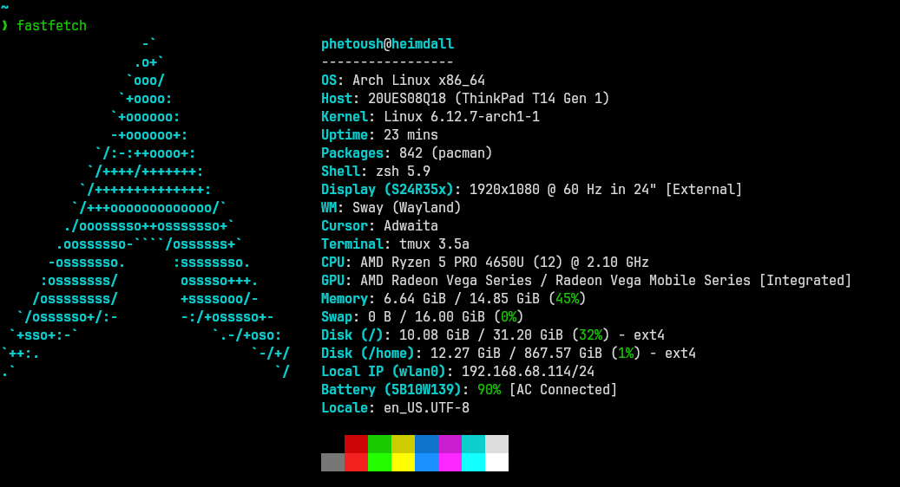

# Personal dotfiles

# Notes

**This environment is "systemd-centric", which simplifies the management of services:**
1. `systemd-resolved` - for DNS resolution
2. `systemd-logind` - for user login sessions
3. `systemd-boot` - as the UEFI boot manager
4. `systemd-networkd` - for the system's network management
5. `iwd` - network management interface

## Additional Setup

**Setting up kmonad for my personal keymaps:**
1. Copy the rules from `./udev/rules.d/` directory to `/etc/udev/rules.d/`  
2. create a new group called `uinput`, `$ sudo groupadd uinput`  
3. add the user to the `uinput` group, `$ sudo usermod -aG input,uinput username`  
4. load the newly added udev rules, `$ sudo modprobe uinput`  
5. reboot  
6. enable and start the following services with the `--user` flag  
  - `$ systemctl --user enable kmonad@laptop-kb`  
  - `$ systemctl --user enable kmonad@logitech-k380`  
7. reboot, or start the services right away  

**The audio is not set-up by default, enable the following services**  
1. `$ systemctl --user enable wireplumber`
2. `$ systemctl --user enable pipewire`
3. reboot

**Bluetooth Setup:**
`$ sudo systemctl enable bluetooth`  
`$ sudo systemctl start bluetooth`  

**Set the `systemd-resolved` to recommended mode:**

`# ln -sf /run/systemd/resolve/stub-resolv.conf /etc/resolv.conf`

this mode will provide domain name resolution for software that reads /etc/resolv.conf directly, such as web browsers

**Install additional packages**
1. nvm - `$ curl -o- https://raw.githubusercontent.com/nvm-sh/nvm/v0.40.1/install.sh | bash`
2. zplug - `$ curl -sL --proto-redir -all,https https://raw.githubusercontent.com/zplug/installer/master/installer.zsh | zsh`
